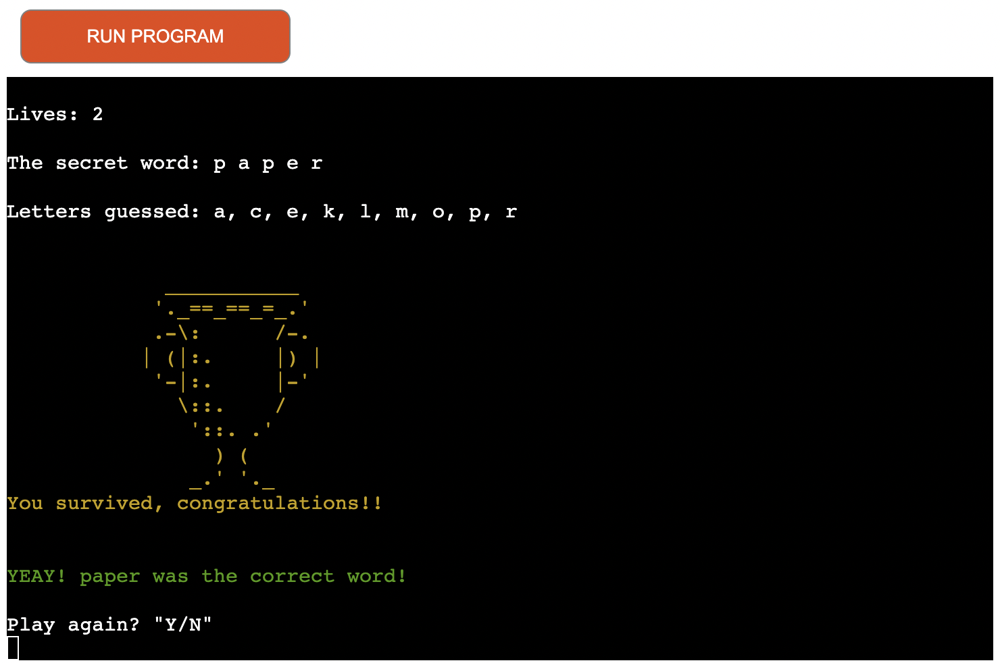

# **PP3-HANGMAN**

PP3-HANGMAN is a Python terminal game, which runs on the Code Institute mock terminal on Heroku. Hang-Hangman is a traditional word guessing game and is for everyone that need a break from real life to collect their thoughts.

* The game can be found [here](https://pp3-hangthe-man.herokuapp.com/).
* The repository can be found [here](https://github.com/malinpalo/pp3-hangman).

&nbsp;

## **Table of Contents**

- [UX](#ux)
    - [Website owners goals](#website-owners-goals)
    - [Users goals](#users-goals)
- [How to play](#how-to-play)
- [Flowchart](#flowchart)
- [Features](#features)
  - [Future features](#future-features) 
- [Testing](#testing)
  - [Code validation](#code-validation)
  - [Bugs](#bugs)
  - [Unfixed Bugs](#unfixed-bugs)
- [Technologies Used](#technologies-used)
  - [Languages](#languages)
  - [Environment](#environment)
  - [Other](#other)
- [Deployment](#deployment)
- [Credits](#credits)

&nbsp;

## UX

### Website owners goals
- To offer entertainment to the user who wants to play the game.
- To provide the user with simple and clear information about the game.
- To provide the user with options to answer with different inputs. 

&nbsp;

### Users goals
For new users:
- To play a game of The Hangman against the computer.
- To easily understand how to play the game.
- To easily navigate in interfaces and commands.
- To always have reference navigation commands available.

Returning visitors:
- To practice their skills in playing The Hangman game against the computer.
- To be able to play The Hangman game as many times as they want.

&nbsp;

[Back to Table of contents](#table-of-contents)

## **How to play** 
- The welcome screen greets the user at first with a colorful logo. The logo comes with rules and options for player to choose to start the game or to choose a difficulty level.
The logo was generated using the Ascii graffiti generator [PatorJK.](https://patorjk.com/software/taag/#p=display&f=Modular&t=HANGMAN)

- If the user chooses option 1. the game starts at a default level of 7 lives and the user will be asked to guess a letter.

- If the user guesses a letter that isn't in the word visuals of the hangman will start building. A varning text in red will inform the user thet the letter guessed was not in the secret word and that the user looses a life. The letter guessed is shown.

- If the user guesses a letter that is in the word a text in green will inform the user that the letter was in the word.

- If the user guesses the same letter all over again a varning text in red will appeare.

- If the user guesses something else than a letter a varning text in red will appeare.

- The player wins when the right letters has been guessed and secret word is being shown. A congratulation logo and text in green will appeare. The user gets the option to enter Y or N to restart the Game. 

- When the user has runned out of lives before guessing the right word the hangman will appeare together with a text of GameOver in red. The user gets the option to enter Y or N to restart the Game.

- The game will start all over without the welcome screen if the player choose to enter Y.

- If the user chooses to enter N a text will wish the user good bye in green with delay. The player will be taken back to the welcome screen.

- If the user chooses option 2 to enter the difficulty level on the welcome screen a menu will appeare. Here the user can go for Easy (10 lives) or Hard (5 lives). The game starts efter entering the level.

&nbsp;

[Back to Table of contents](#table-of-contents)

## **Flowchart**
This was my initial plan for the game, to create the structure and logic of the game. Some of the features have changed as I developed the game.
This flowchart was created using [Lucid Charts](https://www.lucidchart.com/).

&nbsp;

[Back to Table of contents](#table-of-contents)

## **Features**
- The user plays against the computer.
- The computer accepts user input and gives responsive feedback.
- Random word generator.
- The word is encrypted, so the user cannot see the word straight away, only the length appeare.
- If the user guesses wrong letter the guessed letter will be displayed througout the whole game.
- If the user guesses right letter the letter will be displayed in the encrypted word.
- Validation and error handling for duplicate enteries, special characters and numbers.
- Messages to the user are colored in red to stick out from the screen.

### **Future features**
- I like to enable for the user to input name.
- I like to use Google sheets & Api - To keep data by the name of the player. To keep and return game scores. To present highest score etc. 
- I like to enable the user to guess entire word.

&nbsp;

[Back to Table of contents](#table-of-contents)

## **Testing**
- Family and friends tested for functionality.
- Tested for all scenarios with incorrect guesses.
- Tested for all scenarios with successful guess.
- Tested for all scenarios with more than one letter and special characters.
- Tested for empty input.

### **Code validation**
  - [PEP8 CI Python Linter](https://pep8ci.herokuapp.com/) no errors found.
   

### **Bugs**
- Some lines where to long and there where multiple whitespaces in the code during the build up. PEP8 kept track on these when running the code in PEP8 and the errors are fixed.
- Thoroughout testing there where a lack of spaces between lines, that was fixed with "\n".
- After deploying the game I realized that the text for the right guessed letter didn't show. Either did the right letter guessed. This was fixed by removing the uppercase method at the function for generating random words.

### **Unfixed Bugs**
- After deploying the game I found out that the visuals of the hangman getting hanged follows after each wrong letter guessed. I didn't have time to fix these so I left them for features I like to improve.

&nbsp;

[Back to Table of contents](#table-of-contents)

## **Technologies Used**
### **Languages**
- [Python:](https://www.python.org/) Python was the language beeing used for the whole project.
- [Markdown:](https://www.markdownguide.org/basic-syntax/) Markdown language was used for writing the README.md.
 
### **Environment**
- [GitHub:](https://github.com/) hosted the code.
- [GitPod:](https://www.gitpod.io/?utm_source=googleads&utm_medium=search&utm_campaign=dynamic_search_ads&utm_id=16501579379&utm_content=dsa&gclid=EAIaIQobChMIn6TCrsyA-wIVDNPtCh319wDpEAAYASAAEgKK2vD_BwE) was used to write the code.
- [Heroku:](https://id.heroku.com/login) was the cloud hosting platform used for deploying this project.
 
### **Other**
- [Graffiti:](http://patorjk.com/software/taag/#p=display&h=1&v=2&f=Pawp&t=Hangman) was used for the large text images in the game.

&nbsp;

[Back to Table of contents](#table-of-contents)

## **Deployment**
  - The project was deployed using Code Institutes mock terminal for Heroku. 
  - I committed and pushed all code for the game to GitHub from GitPod.
  - I created an account on [Heroku](https://id.heroku.com/login).
  - I clicked on 'New' and clicked 'Create New App'.
- I then chose the correct region, Europe and created a name for my app.
- In settings I sorted out the Buildpacks for everything to work.
- I inputted the python and nodejs buildpacks.
- I then put in the config var PORT 8000.
- I then clicked on the deploy page and linked my GitHub repo with the Heroku app.
- I then deployed the branch at the bottom of the page, ensuring no errors occurred.
- I enabled automatic deploys so if I edit and push the code to GitHub, Heroku automatically updates and redoploys.
- I then opened the game on Heroku to ensure it functions efficiently and checked for any errors that may have occurred.
    
&nbsp;

[Back to Table of contents](#table-of-contents)

## **Credits**
- Lessons from The Code Institute and the Love Sandwiches in assisting with how to start my project.
- [YouTube](https://www.youtube.com/watch?v=cJJTnI22IF8&t=2s&ab_channel=KylieYing) - for inspiration. 
- [YouTube](https://www.youtube.com/watch?v=m4nEnsavl6w) - for inspiration.
- [YouTube](https://www.youtube.com/watch?v=3_CX0aD9Fdg&t=272s) - for inspiration.
- I've used several more youtube videos to get the hang of how to create a Hangman game in python. The above videos are the ones I took most inspiration from.
- [Stackoverflow](https://stackoverflow.com/)
- [W3 Schools](https://www.w3schools.com/)
- [Random Word Generator](https://www.randomlists.com/random-words) - to generate a random list of 500 words for the game.
- Thank you Team Code Institute for always beeing supporting.
- Thank to my cousin and my family for the great support.

&nbsp;

[Back to Table of contents](#table-of-contents)

